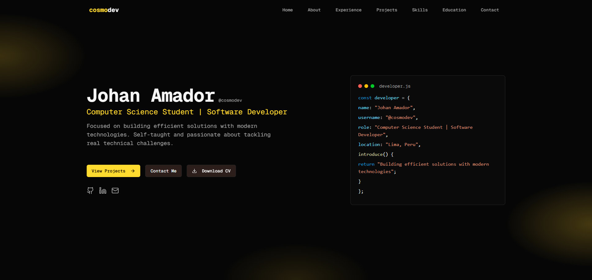

# Johan Amador | Portfolio

Welcome to my personal portfolio! Here you can find my featured projects, skills, and a bit about me as a developer. This site is built with the latest technologies and designed to be fast, modern, and responsive.

## Tech Stack

- **Next.js 14**
- **React 19**
- **TypeScript**
- **Tailwind CSS**
- **shadcn/ui**
- **Lucide Icons**

## Featured Projects

<div align="center">

<table>
  <tr>
    <td align="center" width="25%">
      <a href="https://grunge.vercel.app/">
        <br/>
        <strong>Grunge Merch</strong>
      </a>
      <br/>
      Web interface for an official grunge and rock bands merch store.<br/>
      <a href="https://github.com/UltimateCosmic/grunge">Code</a>
    </td>
    <td align="center" width="25%">
      <a href="https://cinemark-peru.vercel.app/">
        <br/>
        <strong>Cinemark Perú Clone</strong>
      </a>
      <br/>
      Responsive clone of the Cinemark Perú website. Works with official API.<br/>
      <a href="https://github.com/UltimateCosmic/cinemark-peru">Code</a>
    </td>
    <td align="center" width="25%">
      <a href="https://anniversary-project-sage.vercel.app/">
        <br/>
        <strong>Anniversary Project</strong>
      </a>
      <br/>
      A digital memory corner and gift for a loved one.<br/>
      <a href="https://github.com/UltimateCosmic/anniversary-project">Code</a>
    </td>
    <td align="center" width="25%">
      <a href="https://github.com/UltimateCosmic/UltimateCosmic.github.io">
        <br/>
        <strong>Personal Portfolio</strong>
      </a>
      <br/>
      This very site! Modern UI, animated hero, project gallery, and more.<br/>
      <a href="https://github.com/UltimateCosmic/cosmodev">Code</a>
    </td>
  </tr>
</table>

</div>

## Features

- Animated hero section with spotlight effects
- Project gallery with live demos
- Responsive and accessible design
- Custom UI components
- Real-time data integration (Cinemark API)

## Getting Started

```bash
# Clone the repo
https://github.com/UltimateCosmic/cosmodev.git

# Install dependencies
pnpm install # or npm install

# Run locally
pnpm dev # or npm run dev
```

Open [http://localhost:3000](http://localhost:3000) to see the site.

## Deployment

The website is live at [https://cosmodev.me](https://cosmodev.me).

This site is deployed to Namecheap using GitHub Actions for automated static export and upload. GitHub Pages only allows HTML, CSS, and JS files, so a custom workflow is used to deploy the generated static files to Namecheap hosting.

## License

This project is MIT licensed.

---

> Built with Next.js and Tailwind CSS by Johan Amador (@cosmodev)
